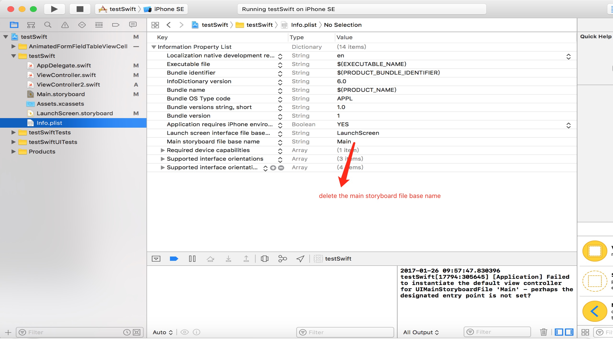

# UserDefaults_Template
1.)For this to successfully work you need to make some changes in info.plist file.
 
 

 
 
2.)In this template just for an example only the login state is saved in Userdefaults, not the login credentials, so therefore all you to need to do is use the button and not the textfields. .
 
 
3.)Make sure to set a storyboard id for the viewcontrollers in the utilities tab.
 
 
